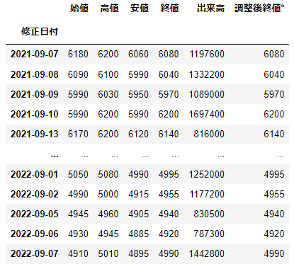
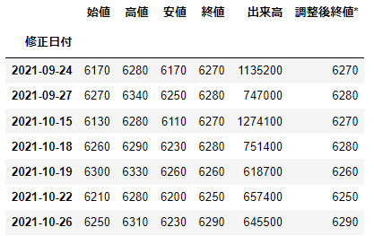
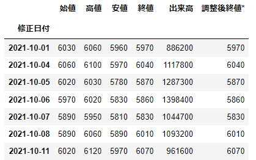
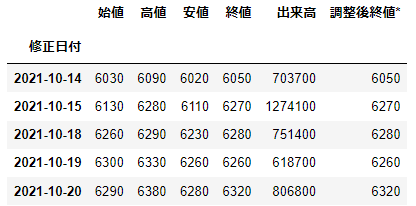

# NEC(6701)株価情報
NEC(6701)の [**HP**](https://finance.yahoo.co.jp/quote/6701.T/history) の株価情報から条件指定でデータ抽出
<br>
## 全データ表示
```
main
```

<br>
## 終値が6250以上、6300未満のデータ表示
```
main[(main['終値'] >= 6250) & (main['終値'] < 6300)]
```

<br>
## 修正日付が「2021年10月」のデータ表示 (表示が途切れているが10月のデータが全て表示)
```
main['2021-10']
```

<br>
## 修正日付が「2021年10月」のデータ表示 (表示が途切れているが10月のデータが全て表示)
```
main[main.index.month == 10]
```

<br>
## 修正日付が「2021年10月14日」から「2021年10月20日」のデータ表示
```
main['2021-10-14':'2021-10-20']
```

<br>
